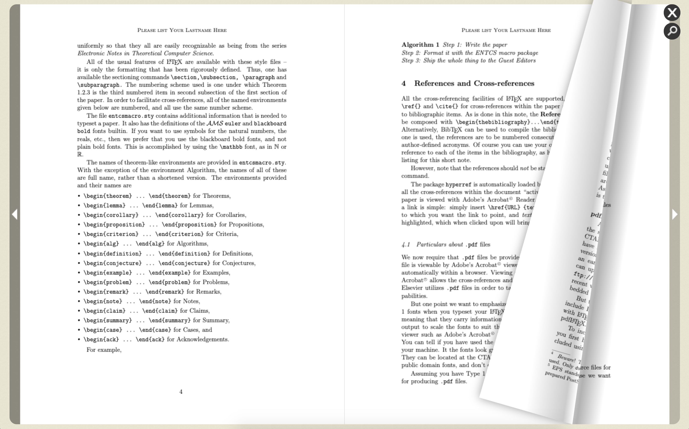

# PDF HTML5 Page Flip

Simple viewer for view your pdf file as flipable using html5 technology.

--- 
### Using
* Run the code with static web server such as http-server
* Navigate under web folder to file viewer.html by url like `http://localhost/web/viewer.html?file=pdf.pdf&magazineMode=true`

### Parameters
* `file` is locate to pdf url
* `magazineMode` option to enable / disable magazine mode default is false

### Screenshot

---
### Credits
* Fork from [https://github.com/iberan/pdfjs-flipbook](https://github.com/iberan/pdfjs-flipbook).  
* Dependency [https://github.com/blasten/turn.js/](https://github.com/blasten/turn.js/)

### Developer
Apinan Woratrakun [iamapinan@gmail.com](mailto:iamapinan@gmail.com)